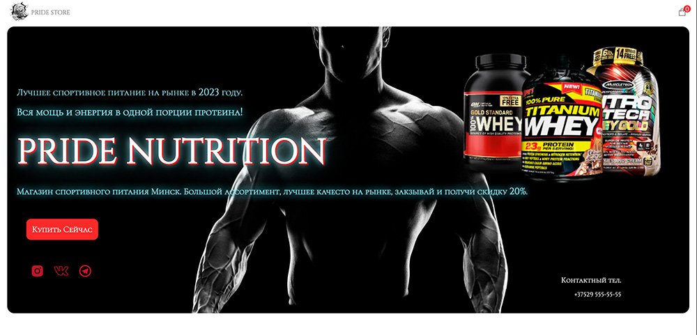
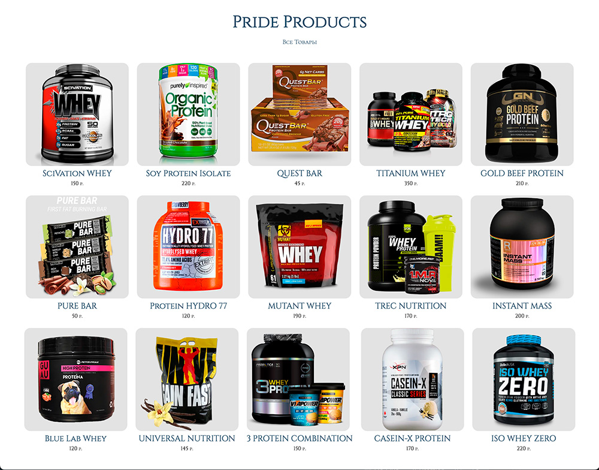
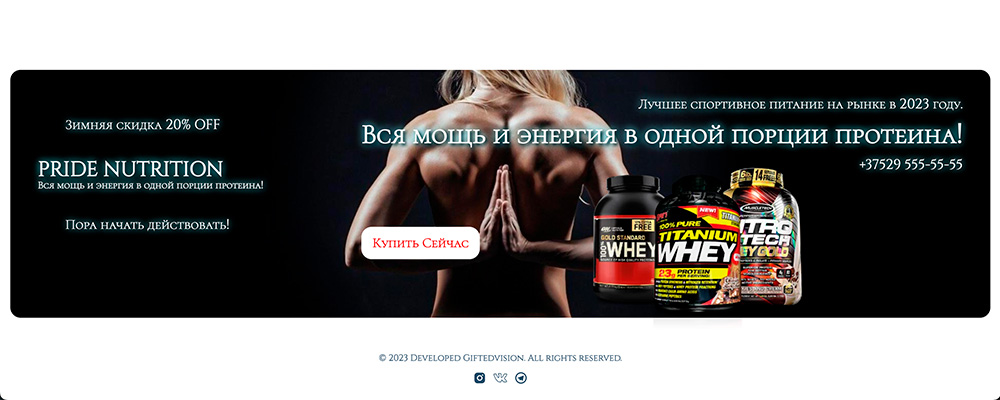
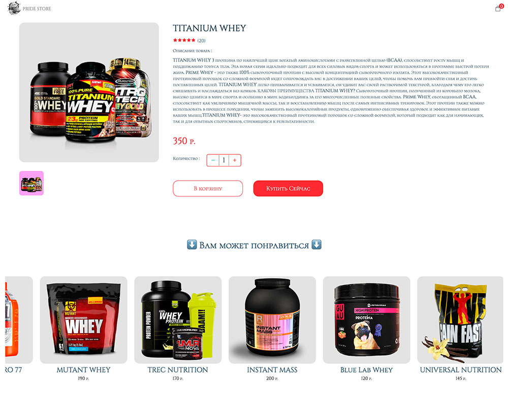
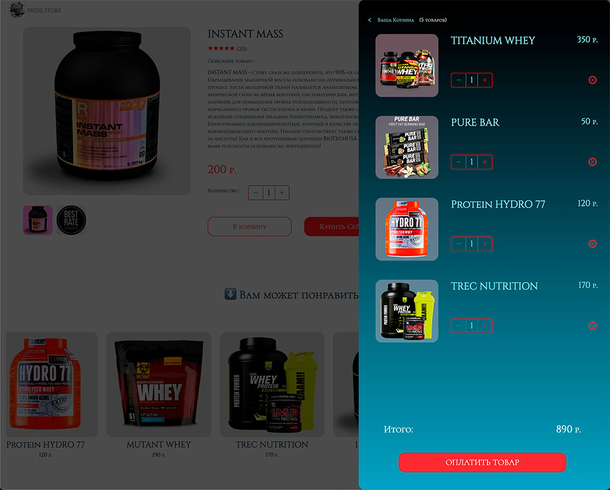
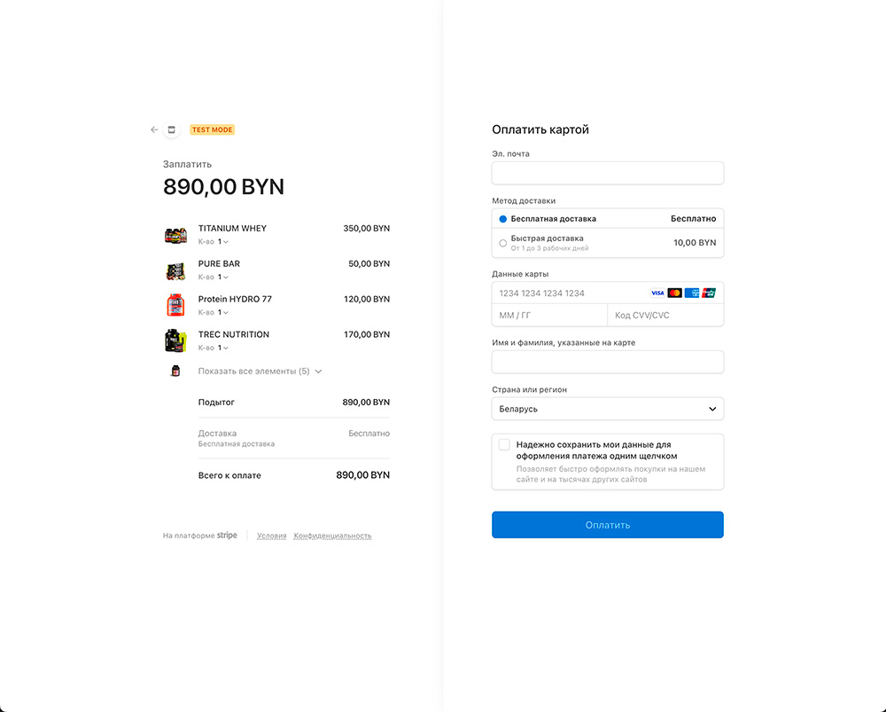
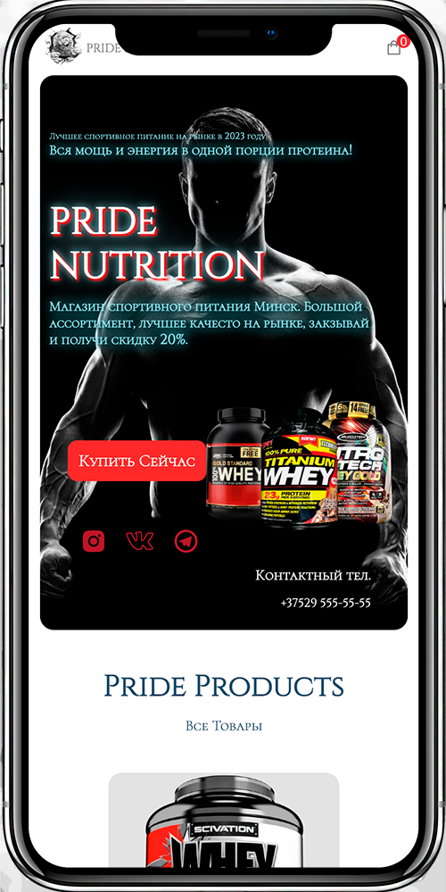
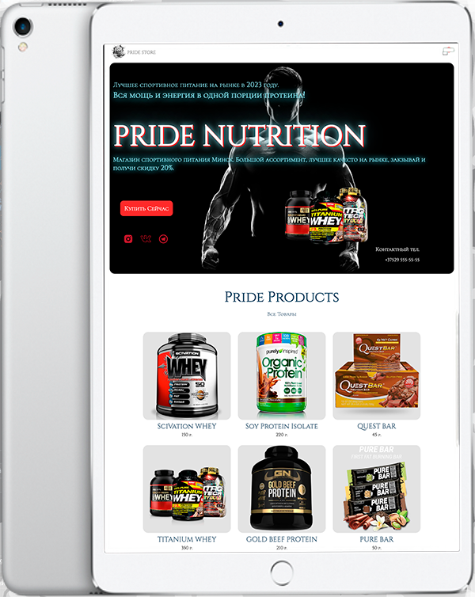

## ECOMMERCE PRIDE NUTRITION 🦁 

      

      

      

      

      

      

 

## Other Devices 📱

      
      

   
   
   
   

## Описание

Создание, адаптация и развёртка интернет-магазина спортивного питания PRIDE NUTRITION. Использование современных технологий веб-разработки NEXT.JS & SANITY. +подключение системы оплаты STRIPE. Смотрите другие мои работы!

## Запросы клиента

Клиент заказал разработать интернет-магазин для различных устройств с максимально возможной оптимизацией сайта для этого я использовал NEXT.js для back-end я использовал SANITY. Также интегрировал систему оплаты STRIPE.

## Description

Creation, adaptation and deployment of an online store of sports nutrition PRIDE NUTRITION. Use of modern web development technologies NEXT.JS & SANITY. + connection of the STRIPE payment system. See my other works!

## Requests

The client ordered to develop an online store for various devices with the maximum possible optimization of the site for this I used NEXT, lkz back-end I used SANITY. Also integrated the STRIPE payment system.

## View Work

- 👀 [
Просмотр работы](https://nutrition-shop.vercel.app)

## 💻 Developer

- [SvirkoAlexander](https://github.com/SvirkoAlexander)

## License 

Project is distributed under the MIT License.
